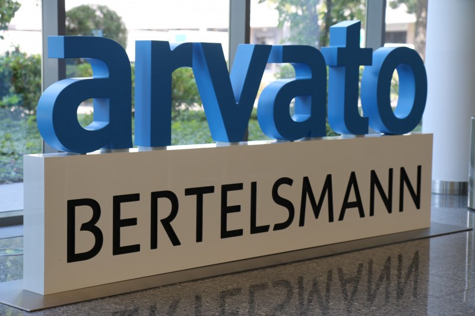

# Pooja_Portfolio

  Data Science Projects are below:

### [Project 1: New York City Airbnb Analysis](https://github.com/poojapatel26/New-York-City-Airbnb) 

* This is a Data Science project with Visualization and Analyisis on Airbnb data of New York City.

* This dataset describes the listing activity and metrics in NYC for 2019 and it aims to provide some facts on Short-Term  Rental or Long-Term Rental use in New York City. And this project answers the below questions and it shows the insights of data.
  1. What can we learn about different hosts and areas?
  2. What can we learn from predictions? (ex: locations, prices, reviews, etc.)
  3. Which hosts are the busiest and why?
  
### [Blog Post](https://medium.com/@poojapatel26/analysis-of-airbnb-data-nyc-2019-eecc84d9852a)    
  
 

### [Project 2: Disaster-Response-Project](https://github.com/poojapatel26/Disaster-Response-Project) 

* This is a Machine learning pipeline to categorize emergency messages based on the needs communicated by Sender.
* The initial dataset contains pre-labelled tweet and messages from real-life disaster.The aim of the project is to build a   Natural Language Processing tool that categorize messages.

* The Project is divided in the following Sections:
  1. Data Processing, ETL Pipeline to extract data from source, clean data and save them in a proper databse structure
  2. Machine Learning Pipeline to train a model able to classify text message in categories
  3. Web App to show model results in real time.
 
 
 
 
 
 ### [Project 3: Arvato Customer Segmentation Project](https://github.com/poojapatel26/Arvato-Bertelsmann-Customer-Segmentation-Project) 
 
* This is a Data Capstone project, Supervised and Unsupervised Learning Algorithms are used to characterize the customer segment of the population and predict   customers for Arvato Financial Solutions.

     

* The Project is divided in the following Sections:
  1. Customer Segmentation Report: In this section,the unsupervised learning technique is used to identify few characteristics for company's existing customers      compared to the general population of Germany.
  2. Supervised Learning Model: In this section, supervised Learning model is used to investigate mailout_train and mailout_test dataset to predict which            individuals are most likely to respond to a mailout campaign.

Kaggle Competition: After chosing the best model, the results submitted to [kaggle](http://www.kaggle.com/t/21e6d45d4c574c7fa2d868f0e8c83140) competition.

### [Blog Post](https://medium.com/@poojapatel26/customer-segmentation-report-for-arvato-financial-solutions-e8389955a67b)
 
 
 
 

