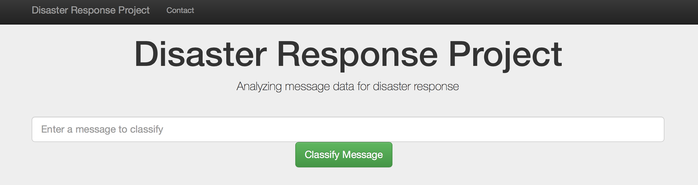

# Pooja_Portfolio
Data Science Projects

### [Project 1: New York City Airbnb Analysis](https://github.com/poojapatel26/New-York-City-Airbnb) 

* This is a Data Science project with Visualization and Analyisis on Airbnb data of New York City.

* This dataset describes the listing activity and metrics in NYC for 2019 and it aims to provide some facts on Short-Term  Rental or Long-Term Rental use in New York City. And this project answers the below questions and it shows the insights of data.
  1. What can we learn about different hosts and areas?
  2. What can we learn from predictions? (ex: locations, prices, reviews, etc.)
  3. Which hosts are the busiest and why?

### [Project 2: Disaster-Response-Project](https://github.com/poojapatel26/Disaster-Response-Project) 

* This is a Machine learning pipeline to categorize emergency messages based on the needs communicated by Sender.
* The initial dataset contains pre-labelled tweet and messages from real-life disaster.The aim of the project is to build a   Natural Language Processing tool that categorize messages.

* The Project is divided in the following Sections:
  1. Data Processing, ETL Pipeline to extract data from source, clean data and save them in a proper databse structure
  2. Machine Learning Pipeline to train a model able to classify text message in categories
  3. Web App to show model results in real time.
 
 
 
 
 

